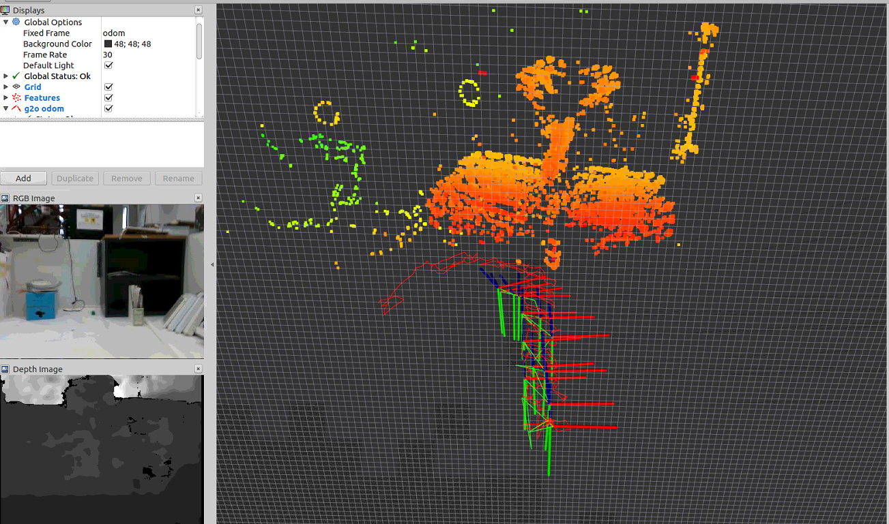
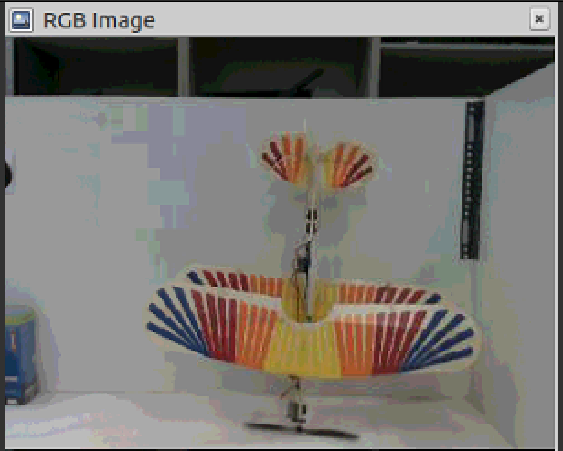
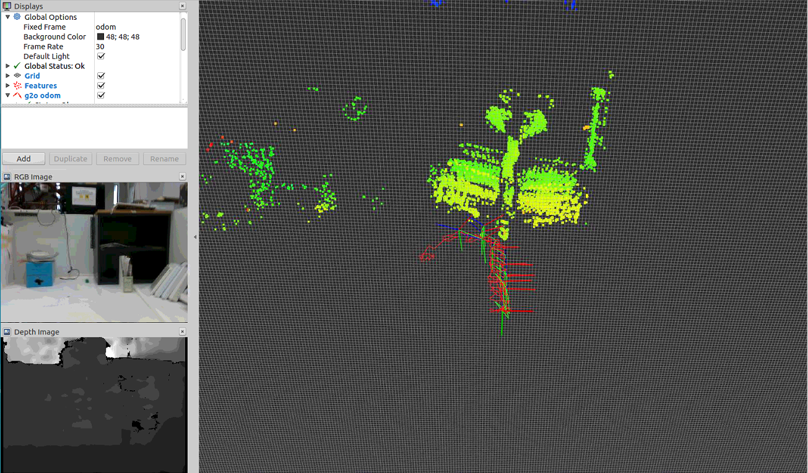

# g2o_slam3d: A ROS-C++ wrapper for Visual SLAM with the G2O Library

## Getting Started
These instructions will get you a copy of the project up and running on your local machine for development and testing purposes.

## Prerequisites
* Ubuntu 16.04 and later
* ROS kinetic and later
* Eigen 3.3.0 and later
* OpenCV 3.3 and later
* [g2o](https://github.com/RainerKuemmerle/g2o)

## Installing
* git clone https://github.com/mrsp/g2o_slam3d.git
* catkin_make

## Launch 
* Specify configuration parameters <b> in a yaml file e.g. in config/intel.yaml </b>
* <b> roslaunch g2o_slam g2o_slam_intel.launch </b>
  (To launch the g2o with 3D Landmarks derived from 2D RGB features + Depth and an (optional) odometry measurements)
* <b> roslaunch g2o_vslam g2o_vslam_intel.launch </b>
 (To launch the g2o Bundle Adjustment with 2D RGB features and an (optional) odometry  measurements)

## Example of 3D VSLAM 
Red is the Visual Odometry, Green is the Keyframes trajectory, frames indicate the estimated poses of Keyframes

  
   

## Example of BA
Red is the Visual Odometry, Green is the Keyframes trajectory, frames indicate the estimated poses of Keyframes

  
   

## Without ROS

## BA with 2 RGB images
./baRGB ../am1.png ../am2.png
## BA with 2 RGB and 2 Depth Images
./baRGBD ../am1.png ../am2.png  ../amd1.png ../amd2.png
